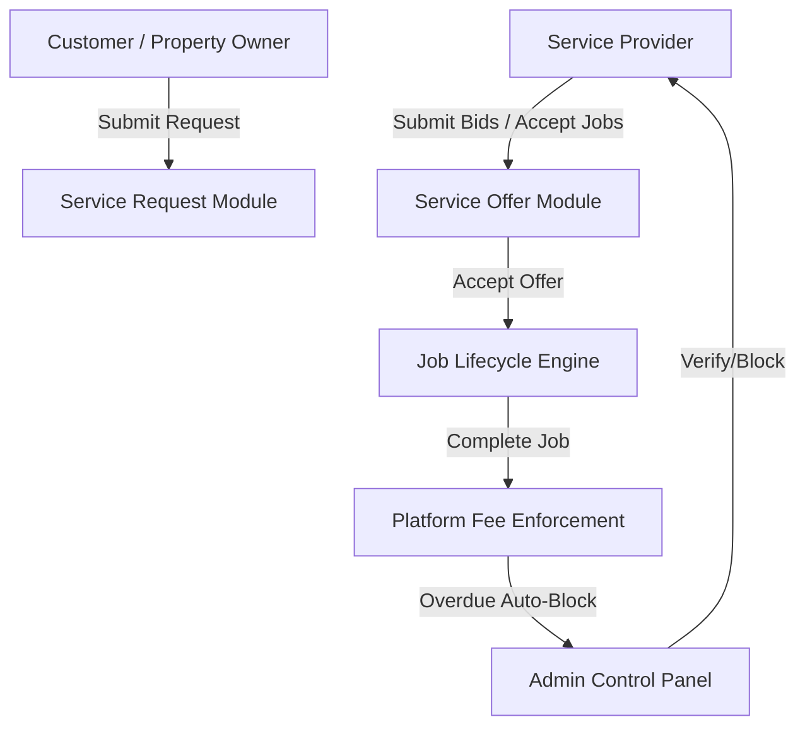

# Home Services Marketplace Architecture

## Overview
The Home Services Marketplace module extends the PakHaven real estate platform with a reverse-marketplace system for property home maintenance services (plumbing, electrical work, painting, HVAC repair, solar maintenance, pest control, etc.).

## Core Architectural Layers

### 1. Database Data Models (Prisma MySQL/MariaDB)
- **`ServiceProviderProfile`**: Extends standard user accounts with CNIC verification, business profile, ratings, service radius, and payment details.
- **`ServiceCategory` & `ServiceSubcategory`**: Category hierarchy with icons and subcategory tags.
- **`ServiceProviderCategory` & `ServiceProviderLocation`**: Operational coverage mappings per provider.
- **`ServiceRequest`**: Customer posted job request containing category, Pakistan location details, preferred schedule, and description.
- **`ServiceOffer`**: Provider competitive quote with fixed price, timeline, breakdown, and terms.
- **`ServiceJob`**: Active job generated upon offer acceptance, backed by state machine (`ServiceJobStatusHistory`).
- **`PlatformFeeConfig` & `ProviderFee`**: Fee tracking with gross amount, platform percentage, net payout, and overdue invoice status.
- **`ProviderReview`**: Star ratings (1–5) and feedback linked to completed jobs and verified customer requests.

### 2. State Machines & Enums

#### Service Request Lifecycle
- `OPEN` $\rightarrow$ `OFFER_RECEIVED` $\rightarrow$ `ACCEPTED` $\rightarrow$ `COMPLETED` / `CANCELLED` / `EXPIRED`

#### Service Job Lifecycle
- `ASSIGNED` $\rightarrow$ `IN_PROGRESS` $\rightarrow$ `COMPLETED` / `CANCELLED`

#### Provider Verification Status
- `PENDING` $\rightarrow$ `VERIFIED` / `REJECTED` / `SUSPENDED`

#### Fee Status & Auto-Blocking
- `PENDING` $\rightarrow$ `PAID` / `OVERDUE` (Triggered via `/api/admin/fees/enforce` cron or manual enforcement; providers with `OVERDUE` fees are automatically `isBlocked: true`).

### 3. Security & Access Control
- Server-side authorization in all API routes via session cookies (`lib/auth.ts`).
- Admin permissions enforced via `checkAdminOrEmployeePermission()` (`lib/adminAuth.ts`).
- Ownership verification on customer and provider actions (IDOR protection).
- Input validation on prices, review ratings, and state transitions.
